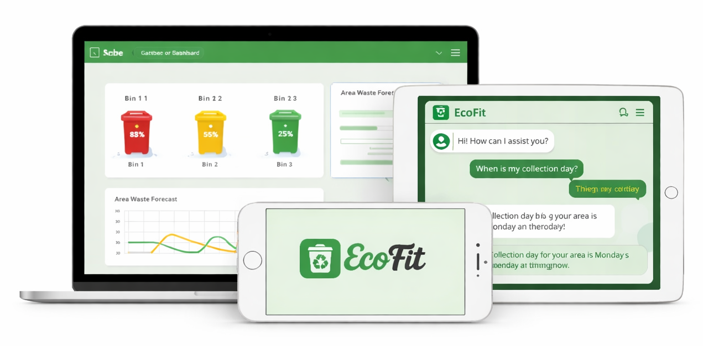

# EcoFit

<div align="center">
  
</div>

EcoFit is a waste management and tax application with a **FastAPI backend** and an **Expo (React Native) mobile app**. It supports waste classification, overflow prediction, tax/household management, RAG-based AI assistant, and complaints.

---

## Repository structure

```
EcoFit_app/
├── backend/waste-classification/   # FastAPI backend
│   ├── api/                       # App entry (main.py)
│   ├── core/                      # Config, database
│   ├── routers/                  # API routes
│   ├── jobs/                      # Schedulers, retraining
│   ├── run.py                     # Run server
│   └── requirements.txt
├── mobile/                        # Expo (React Native) app
│   ├── app/                       # Screens, components, utils
│   ├── App.tsx
│   └── package.json
└── README.md
```

---

## Backend (FastAPI)

### Prerequisites

- **Python 3.10+**
- **MongoDB** (running locally or remote)
- **Environment variables** (see below)

### Environment variables

Create a `.env` file in the **project root** (`EcoFit_app/`) with at least:

```env
# Required
MONGODB_URL=mongodb://localhost:27017
MONGODB_DB_NAME=ecofit
GROQ_API_KEY=your_groq_api_key

# Optional (defaults shown)
RAG_DIR=rag_data/
API_HOST=0.0.0.0
API_PORT=8000
```

### Setup and run

```bash
cd EcoFit_app/backend/waste-classification
python -m venv venv
# Windows:
venv\Scripts\activate
# macOS/Linux:
# source venv/bin/activate
pip install -r requirements.txt
python run.py
```

Or with uvicorn directly:

```bash
uvicorn api.main:app --host 0.0.0.0 --port 8000 --reload
```

- **API base:** `http://localhost:8000`
- **Interactive docs:** `http://localhost:8000/docs`
- **Root:** `GET /` — API info  
- **Health:** `GET /ping`, `GET /api/v1/health`

### Main API areas

| Area        | Prefix              | Examples |
|------------|---------------------|----------|
| Health     | `/api/v1`           | `GET /health`, `GET /health/db` |
| User       | `/api/v1/user`      | `POST /register`, `POST /login` |
| Dispose    | `/api/v1`            | `POST /dispose`, `POST /dispose/upload`, `POST /dispose/tips` |
| RAG (AI)   | `/api/v1/rag`       | `POST /rag/ask` |
| Overflow   | `/api/v1/overflow`  | `GET /predict`, `GET /forecast`, `POST /model/retrain` |
| Tax        | `/api/v1`            | `POST /create_user`, `GET /get_next_id`, `POST /process_weekly_waste`, `POST /predict_next_week`, etc. |
| Collector  | `/api/v1`            | `GET /next-id`, `POST /submit_weight_for_review`, `GET /leaderboard/weekly`, etc. |
| Complaints | `/api/v1`            | `POST /complaints`, `GET /complaints/live` |
| Distance   | `/api/v1`            | `POST /check-distance` |

---

## Mobile app (Expo / React Native)

### Prerequisites

- **Node.js 18+**
- **Expo Go** on your phone (optional, for quick testing)
- Backend running and reachable (same network or tunnel)

### API URL configuration

The app calls the backend at `API_URL`. Default is `http://192.168.43.164:8000/api/v1`.

- **Change at build/runtime:** set `API_URL` (e.g. in `.env` or app config).
- **Code:** `mobile/app/utils/config.ts` — `getApiUrl()` / `API_URL`. Use your machine’s LAN IP when testing on a real device (e.g. `http://<YOUR_IP>:8000/api/v1`).

### Setup and run

```bash
cd EcoFit_app/mobile
npm install
npx expo start
```

Then:

- **Physical device:** Scan the QR code with Expo Go (same Wi‑Fi as the dev machine).
- **Android emulator:** `npx expo start --android`
- **iOS simulator (Mac):** `npx expo start --ios`
- **Web:** `npx expo start --web`

Clear cache if needed:

```bash
npx expo start --clear
```

### Main app features (from the mobile app)

- Logo / onboarding
- Login / registration (backend user APIs)
- Main dashboard: connected bins, next pickup, bin guide
- Check waste type (classification) and tax flow
- Tax: household creation, payment, dashboard
- AI Agent (RAG chat)
- Complaints
- Overflow prediction, tips, disposal guidance

---

## Running backend and mobile together

1. Start **MongoDB**.
2. In `EcoFit_app/`, create `.env` and set `MONGODB_URL`, `MONGODB_DB_NAME`, `GROQ_API_KEY`.
3. Start backend:
   ```bash
   cd backend/waste-classification && python run.py
   ```
4. Set mobile `API_URL` to your backend (e.g. `http://<YOUR_IP>:8000/api/v1` in `mobile/app/utils/config.ts` or env).
5. Start mobile:
   ```bash
   cd mobile && npx expo start
   ```
6. Open the app on device/emulator and ensure it’s on the same network as the backend.

---

## Troubleshooting

### Backend

- **MongoDB connection errors:** Check `MONGODB_URL` and that MongoDB is running.
- **Missing env vars:** Ensure `.env` is in the repo root and all required variables are set.
- **Import errors:** Run from `backend/waste-classification`: `python run.py` or `uvicorn api.main:app --host 0.0.0.0 --port 8000`.

### Mobile

- **Metro / cache issues:** `npx expo start --clear`
- **Cannot reach API:** Use your computer’s LAN IP in `API_URL`, not `localhost`. Or use `npx expo start --tunnel` and point `API_URL` to your tunnel URL if needed.
- **Dependencies:** `npm install` then `npx expo install --fix` if Expo reports version mismatches.

---

## API documentation

When the backend is running:

- **Swagger UI:** [http://localhost:8000/docs](http://localhost:8000/docs)
- **ReDoc:** [http://localhost:8000/redoc](http://localhost:8000/redoc)

RAG endpoint: `POST /api/v1/rag/ask` (body: `query`, `user_id`).
